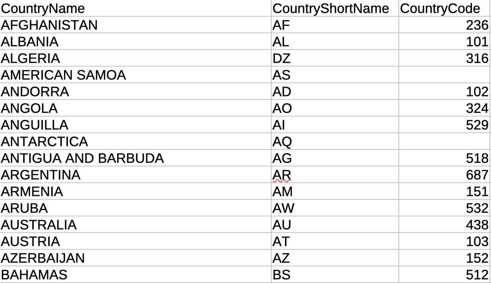
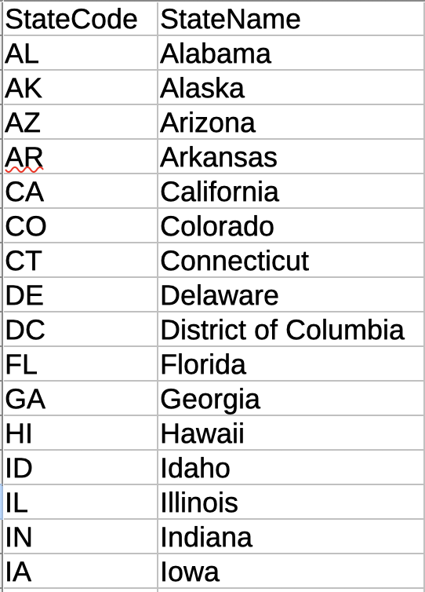
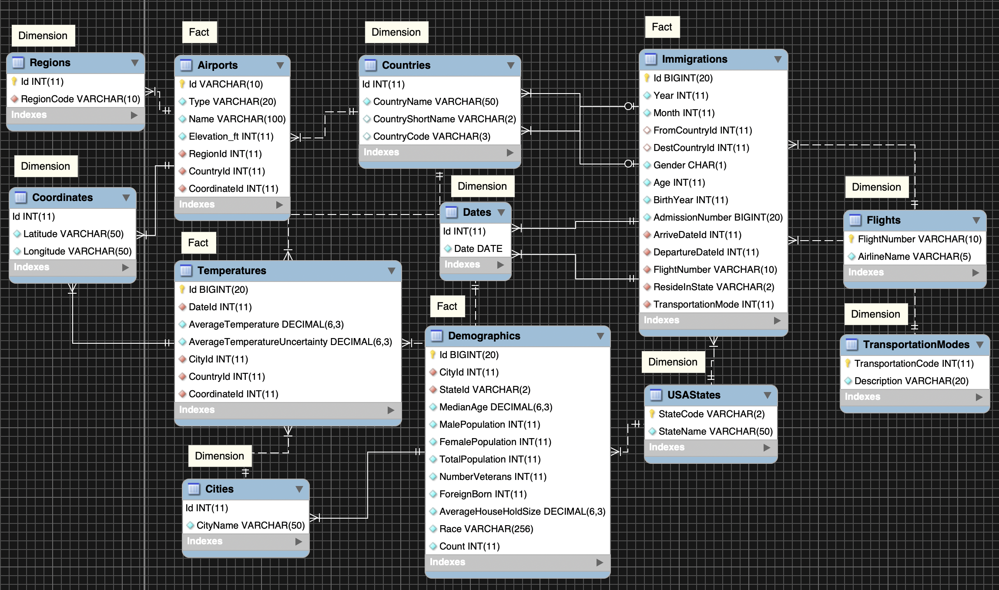
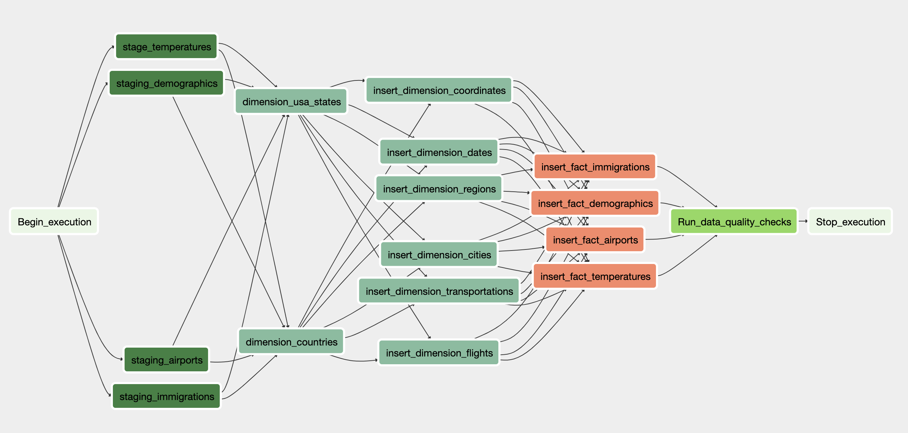

# Project 5: Data Engineering Capstone

## Scope

As a data engineer, I have a task to extract data from different sources so the rest of my team can use and analyse it to answer queries. My role is to create a data lake to where the data will be stored. I have to define the model's dimension and fact tables and clean the data. I need to check for any inconsistencies and transform the data that then gets loaded in AWS S3 bucket. It will be moved to staging tables and finally, into the dimension and fact tables. 

## Dataset

Below are the datasets that will be used for this project.
	1. U.S immigration sas - contains immigration information
	2. GlobalLandTemperaturesByCity.csv - contains average temperature of a city
	3. us-cities-demographics.csv - contains US cities' demographics such as male/female population
	4. airport-codes_csv.csv -contains list of airports with their codes
    5. countries.csv - contains list of countries with their codes
    6. USA_States.csv - contains list of USA States with their codes

## Steps Done in this Project

1. Created a process to extract, clean, transform the data using pyspark.
2. Uploaded the data into AWS S3 as JSON and CSV files.
3. Imported them into the staging tables in Redshift.
4. Selected necessary data and inserted it into fact and dimension tables in Redshift.
5. Airflow is used to automate this data loading.


## Dataset

Below are the datasets that will be used for this project.
	1. U.S immigration sas - contains immigration information

```

+---------+------+------+------+------+-------+-------+-------+-------+-------+------+-------+-----+--------+--------+-----+-------+-------+-------+-------+-------+--------+------+------+-------+---------------+-----+--------+
|    cicid| i94yr|i94mon|i94cit|i94res|i94port|arrdate|i94mode|i94addr|depdate|i94bir|i94visa|count|dtadfile|visapost|occup|entdepa|entdepd|entdepu|matflag|biryear| dtaddto|gender|insnum|airline|         admnum|fltno|visatype|
+---------+------+------+------+------+-------+-------+-------+-------+-------+------+-------+-----+--------+--------+-----+-------+-------+-------+-------+-------+--------+------+------+-------+---------------+-----+--------+
|1817663.0|2016.0|   4.0| 148.0| 131.0|    SFR|20554.0|    1.0|     CA|20560.0|  23.0|    2.0|  1.0|20160410|    null| null|      G|      O|   null|      M| 1993.0|07082016|     F|  null|     LX|5.5960415633E10|00038|      WT|
|1817664.0|2016.0|   4.0| 148.0| 131.0|    SFR|20554.0|    1.0|     CA|20561.0|  29.0|    1.0|  1.0|20160410|    null| null|      G|      O|   null|      M| 1987.0|07082016|     M|  null|     LX|5.5960341333E10|00038|      WB|
|1817665.0|2016.0|   4.0| 148.0| 131.0|    SFR|20554.0|    1.0|     CA|20563.0|  47.0|    1.0|  1.0|20160410|    null| null|      G|      O|   null|      M| 1969.0|07082016|     M|  null|     LX|5.5960409133E10|00038|      WB|
|1817666.0|2016.0|   4.0| 148.0| 131.0|    SFR|20554.0|    1.0|     CA|20571.0|  37.0|    2.0|  1.0|20160410|    null| null|      G|      O|   null|      M| 1979.0|07082016|     F|  null|     LX|5.5960690633E10|00038|      WT|
|1817667.0|2016.0|   4.0| 148.0| 131.0|    SFR|20554.0|    1.0|     CA|20573.0|  41.0|    2.0|  1.0|20160410|    null| null|      G|      O|   null|      M| 1975.0|07082016|     M|  null|     LX|5.5961022433E10|00038|      WT|
|1817668.0|2016.0|   4.0| 148.0| 131.0|    SFR|20554.0|    1.0|     CA|20573.0|  37.0|    2.0|  1.0|20160410|    null| null|      G|      O|   null|      M| 1979.0|07082016|     F|  null|     LX|5.5960942733E10|00038|      WT|
|1817669.0|2016.0|   4.0| 148.0| 131.0|    SFR|20554.0|    1.0|     CA|20555.0|  53.0|    1.0|  1.0|20160410|    null| null|      O|      I|   null|      M| 1963.0|07082016|  null|  null|     BA|5.5959199133E10|00287|      WB|
|1817670.0|2016.0|   4.0| 148.0| 131.0|    SFR|20554.0|    1.0|     CA|20557.0|  42.0|    1.0|  1.0|20160410|    null| null|      O|      O|   null|      M| 1974.0|07082016|  null|  null|     LX|5.5957414433E10|00038|      WB|
|1817671.0|2016.0|   4.0| 148.0| 131.0|    SFR|20554.0|    1.0|     CA|20565.0|  52.0|    1.0|  1.0|20160410|    null| null|      O|      O|   null|      M| 1964.0|07082016|  null|  null|     KL|5.5930420433E10|00605|      WB|
|1817672.0|2016.0|   4.0| 148.0| 131.0|    SFR|20554.0|    1.0|     CA|20573.0|  40.0|    1.0|  1.0|20160410|    null| null|      O|      O|   null|      M| 1976.0|07082016|  null|  null|     BA|5.5959285333E10|00287|      WB|
|1817673.0|2016.0|   4.0| 148.0| 131.0|    SFR|20554.0|    1.0|     HI|20563.0|  51.0|    2.0|  1.0|20160410|    null| null|      G|      O|   null|      M| 1965.0|07082016|     F|  null|     LX|5.5960600833E10|00038|      WT|
|1817674.0|2016.0|   4.0| 148.0| 131.0|    SFR|20554.0|    1.0|     US|20566.0|  51.0|    2.0|  1.0|20160410|    null| null|      G|      O|   null|      M| 1965.0|07082016|     F|  null|     LX|5.5959785933E10|00038|      WT|
|1817675.0|2016.0|   4.0| 148.0| 131.0|    TAM|20554.0|    1.0|     FL|20561.0|  63.0|    1.0|  1.0|20160410|    null| null|      G|      O|   null|      M| 1953.0|07082016|     M|  null|     WK|5.5955630633E10|00004|      WB|
|1817676.0|2016.0|   4.0| 148.0| 131.0|    TAM|20554.0|    1.0|     FL|20563.0|  53.0|    2.0|  1.0|20160410|    null| null|      G|      O|   null|      M| 1963.0|07082016|     F|  null|     WK|5.5956536233E10|00004|      WT|
|1817677.0|2016.0|   4.0| 148.0| 131.0|    TAM|20554.0|    1.0|     FL|20563.0|  18.0|    2.0|  1.0|20160410|    null| null|      G|      O|   null|      M| 1998.0|07082016|     M|  null|     WK|5.5956678333E10|00004|      WT|
|1817678.0|2016.0|   4.0| 148.0| 131.0|    TAM|20554.0|    1.0|     FL|20563.0|  15.0|    2.0|  1.0|20160410|    null| null|      G|      O|   null|      M| 2001.0|07082016|     M|  null|     WK|5.5956591233E10|00004|      WT|
|1817679.0|2016.0|   4.0| 148.0| 131.0|    TAM|20554.0|    1.0|     FL|20568.0|  76.0|    2.0|  1.0|20160410|    null| null|      G|      O|   null|      M| 1940.0|07082016|     F|  null|     WK|5.5953919133E10|00004|      WT|
|1817680.0|2016.0|   4.0| 148.0| 131.0|    TAM|20554.0|    1.0|     FL|20568.0|  45.0|    2.0|  1.0|20160410|    null| null|      G|      O|   null|      M| 1971.0|07082016|     F|  null|     WK|5.5953831133E10|00004|      WT|
|1817682.0|2016.0|   4.0| 148.0| 131.0|    CLG|20554.0|    1.0|     NV|20568.0|  46.0|    2.0|  1.0|20160410|    null| null|      G|      O|   null|      M| 1970.0|07082016|     M|  null|     RV|5.5955955033E10|01876|      WT|
|1817683.0|2016.0|   4.0| 148.0| 131.0|    TOR|20554.0|    1.0|     NY|   null|  35.0|    2.0|  1.0|20160410|    null| null|      G|   null|   null|   null| 1981.0|07082016|     M|  null|     AC|5.5909671733E10|00710|      WT|
+---------+------+------+------+------+-------+-------+-------+-------+-------+------+-------+-----+--------+--------+-----+-------+-------+-------+-------+-------+--------+------+------+-------+---------------+-----+--------+
only showing top 20 rows
```

```
df_immig_read.printSchema()

root
 |-- cicid: double (nullable = true)
 |-- i94yr: double (nullable = true)
 |-- i94mon: double (nullable = true)
 |-- i94cit: double (nullable = true)
 |-- i94res: double (nullable = true)
 |-- i94port: string (nullable = true)
 |-- arrdate: double (nullable = true)
 |-- i94mode: double (nullable = true)
 |-- i94addr: string (nullable = true)
 |-- depdate: double (nullable = true)
 |-- i94bir: double (nullable = true)
 |-- i94visa: double (nullable = true)
 |-- count: double (nullable = true)
 |-- dtadfile: string (nullable = true)
 |-- visapost: string (nullable = true)
 |-- occup: string (nullable = true)
 |-- entdepa: string (nullable = true)
 |-- entdepd: string (nullable = true)
 |-- entdepu: string (nullable = true)
 |-- matflag: string (nullable = true)
 |-- biryear: double (nullable = true)
 |-- dtaddto: string (nullable = true)
 |-- gender: string (nullable = true)
 |-- insnum: string (nullable = true)
 |-- airline: string (nullable = true)
 |-- admnum: double (nullable = true)
 |-- fltno: string (nullable = true)
 |-- visatype: string (nullable = true)
```

	2. GlobalLandTemperaturesByCity.csv - contains average temperature of a city (https://www.kaggle.com/berkeleyearth/climate-change-earth-surface-temperature-data)


```

+----------+-------------------+-----------------------------+-----+-------+--------+---------+
|        dt| AverageTemperature|AverageTemperatureUncertainty| City|Country|Latitude|Longitude|
+----------+-------------------+-----------------------------+-----+-------+--------+---------+
|1743-11-01|              6.068|           1.7369999999999999|Århus|Denmark|  57.05N|   10.33E|
|1743-12-01|               null|                         null|Århus|Denmark|  57.05N|   10.33E|
|1744-01-01|               null|                         null|Århus|Denmark|  57.05N|   10.33E|
|1744-02-01|               null|                         null|Århus|Denmark|  57.05N|   10.33E|
|1744-03-01|               null|                         null|Århus|Denmark|  57.05N|   10.33E|
|1744-04-01| 5.7879999999999985|           3.6239999999999997|Århus|Denmark|  57.05N|   10.33E|
|1744-05-01|             10.644|           1.2830000000000001|Århus|Denmark|  57.05N|   10.33E|
|1744-06-01| 14.050999999999998|                        1.347|Århus|Denmark|  57.05N|   10.33E|
|1744-07-01|             16.082|                        1.396|Århus|Denmark|  57.05N|   10.33E|
|1744-08-01|               null|                         null|Århus|Denmark|  57.05N|   10.33E|
|1744-09-01| 12.780999999999999|                        1.454|Århus|Denmark|  57.05N|   10.33E|
|1744-10-01|               7.95|                         1.63|Århus|Denmark|  57.05N|   10.33E|
|1744-11-01|  4.638999999999999|           1.3019999999999998|Århus|Denmark|  57.05N|   10.33E|
|1744-12-01|0.12199999999999987|                        1.756|Århus|Denmark|  57.05N|   10.33E|
|1745-01-01|-1.3330000000000002|                        1.642|Århus|Denmark|  57.05N|   10.33E|
|1745-02-01|             -2.732|                        1.358|Århus|Denmark|  57.05N|   10.33E|
|1745-03-01|              0.129|                        1.088|Århus|Denmark|  57.05N|   10.33E|
|1745-04-01|              4.042|                        1.138|Århus|Denmark|  57.05N|   10.33E|
|1745-05-01|               null|                         null|Århus|Denmark|  57.05N|   10.33E|
|1745-06-01|               null|                         null|Århus|Denmark|  57.05N|   10.33E|
+----------+-------------------+-----------------------------+-----+-------+--------+---------+
only showing top 20 rows


df_temper.printSchema()

root
 |-- dt: string (nullable = true)
 |-- AverageTemperature: string (nullable = true)
 |-- AverageTemperatureUncertainty: string (nullable = true)
 |-- City: string (nullable = true)
 |-- Country: string (nullable = true)
 |-- Latitude: string (nullable = true)
 |-- Longitude: string (nullable = true)

```

	3. us-cities-demographics.csv - contains US cities' demographics such as male/female population


```

+----------------+--------------+----------+---------------+-----------------+----------------+------------------+------------+----------------------+----------+--------------------+------+
|            City|         State|Median Age|Male Population|Female Population|Total Population|Number of Veterans|Foreign-born|Average Household Size|State Code|                Race| Count|
+----------------+--------------+----------+---------------+-----------------+----------------+------------------+------------+----------------------+----------+--------------------+------+
|   Silver Spring|      Maryland|      33.8|          40601|            41862|           82463|              1562|       30908|                   2.6|        MD|  Hispanic or Latino| 25924|
|          Quincy| Massachusetts|      41.0|          44129|            49500|           93629|              4147|       32935|                  2.39|        MA|               White| 58723|
|          Hoover|       Alabama|      38.5|          38040|            46799|           84839|              4819|        8229|                  2.58|        AL|               Asian|  4759|
|Rancho Cucamonga|    California|      34.5|          88127|            87105|          175232|              5821|       33878|                  3.18|        CA|Black or African-...| 24437|
|          Newark|    New Jersey|      34.6|         138040|           143873|          281913|              5829|       86253|                  2.73|        NJ|               White| 76402|
|          Peoria|      Illinois|      33.1|          56229|            62432|          118661|              6634|        7517|                   2.4|        IL|American Indian a...|  1343|
|        Avondale|       Arizona|      29.1|          38712|            41971|           80683|              4815|        8355|                  3.18|        AZ|Black or African-...| 11592|
|     West Covina|    California|      39.8|          51629|            56860|          108489|              3800|       37038|                  3.56|        CA|               Asian| 32716|
|        O'Fallon|      Missouri|      36.0|          41762|            43270|           85032|              5783|        3269|                  2.77|        MO|  Hispanic or Latino|  2583|
|      High Point|North Carolina|      35.5|          51751|            58077|          109828|              5204|       16315|                  2.65|        NC|               Asian| 11060|
|          Folsom|    California|      40.9|          41051|            35317|           76368|              4187|       13234|                  2.62|        CA|  Hispanic or Latino|  5822|
|          Folsom|    California|      40.9|          41051|            35317|           76368|              4187|       13234|                  2.62|        CA|American Indian a...|   998|
|    Philadelphia|  Pennsylvania|      34.1|         741270|           826172|         1567442|             61995|      205339|                  2.61|        PA|               Asian|122721|
|         Wichita|        Kansas|      34.6|         192354|           197601|          389955|             23978|       40270|                  2.56|        KS|  Hispanic or Latino| 65162|
|         Wichita|        Kansas|      34.6|         192354|           197601|          389955|             23978|       40270|                  2.56|        KS|American Indian a...|  8791|
|      Fort Myers|       Florida|      37.3|          36850|            37165|           74015|              4312|       15365|                  2.45|        FL|               White| 50169|
|      Pittsburgh|  Pennsylvania|      32.9|         149690|           154695|          304385|             17728|       28187|                  2.13|        PA|               White|208863|
|          Laredo|         Texas|      28.8|         124305|           131484|          255789|              4921|       68427|                  3.66|        TX|American Indian a...|  1253|
|        Berkeley|    California|      32.5|          60142|            60829|          120971|              3736|       25000|                  2.35|        CA|               Asian| 27089|
|     Santa Clara|    California|      35.2|          63278|            62938|          126216|              4426|       52281|                  2.75|        CA|               White| 55847|
+----------------+--------------+----------+---------------+-----------------+----------------+------------------+------------+----------------------+----------+--------------------+------+
only showing top 20 rows


df_demographic.printSchema()

root
 |-- City: string (nullable = true)
 |-- State: string (nullable = true)
 |-- Median Age: string (nullable = true)
 |-- Male Population: string (nullable = true)
 |-- Female Population: string (nullable = true)
 |-- Total Population: string (nullable = true)
 |-- Number of Veterans: string (nullable = true)
 |-- Foreign-born: string (nullable = true)
 |-- Average Household Size: string (nullable = true)
 |-- State Code: string (nullable = true)
 |-- Race: string (nullable = true)
 |-- Count: string (nullable = true)
 
```

	4. airport-codes_csv.csv -contains list of airports with their codes
 

```

+-----+-------------+--------------------+------------+---------+-----------+----------+------------+--------+---------+----------+--------------------+
|ident|         type|                name|elevation_ft|continent|iso_country|iso_region|municipality|gps_code|iata_code|local_code|         coordinates|
+-----+-------------+--------------------+------------+---------+-----------+----------+------------+--------+---------+----------+--------------------+
|  00A|     heliport|   Total Rf Heliport|          11|       NA|         US|     US-PA|    Bensalem|     00A|     null|       00A|-74.9336013793945...|
| 00AA|small_airport|Aero B Ranch Airport|        3435|       NA|         US|     US-KS|       Leoti|    00AA|     null|      00AA|-101.473911, 38.7...|
| 00AK|small_airport|        Lowell Field|         450|       NA|         US|     US-AK|Anchor Point|    00AK|     null|      00AK|-151.695999146, 5...|
| 00AL|small_airport|        Epps Airpark|         820|       NA|         US|     US-AL|     Harvest|    00AL|     null|      00AL|-86.7703018188476...|
| 00AR|       closed|Newport Hospital ...|         237|       NA|         US|     US-AR|     Newport|    null|     null|      null| -91.254898, 35.6087|
| 00AS|small_airport|      Fulton Airport|        1100|       NA|         US|     US-OK|        Alex|    00AS|     null|      00AS|-97.8180194, 34.9...|
| 00AZ|small_airport|      Cordes Airport|        3810|       NA|         US|     US-AZ|      Cordes|    00AZ|     null|      00AZ|-112.165000915527...|
| 00CA|small_airport|Goldstone /Gts/ A...|        3038|       NA|         US|     US-CA|     Barstow|    00CA|     null|      00CA|-116.888000488, 3...|
| 00CL|small_airport| Williams Ag Airport|          87|       NA|         US|     US-CA|       Biggs|    00CL|     null|      00CL|-121.763427, 39.4...|
| 00CN|     heliport|Kitchen Creek Hel...|        3350|       NA|         US|     US-CA| Pine Valley|    00CN|     null|      00CN|-116.4597417, 32....|
| 00CO|       closed|          Cass Field|        4830|       NA|         US|     US-CO|  Briggsdale|    null|     null|      null|-104.344002, 40.6...|
| 00FA|small_airport| Grass Patch Airport|          53|       NA|         US|     US-FL|    Bushnell|    00FA|     null|      00FA|-82.2190017700195...|
| 00FD|     heliport|  Ringhaver Heliport|          25|       NA|         US|     US-FL|   Riverview|    00FD|     null|      00FD|-82.3453979492187...|
| 00FL|small_airport|   River Oak Airport|          35|       NA|         US|     US-FL|  Okeechobee|    00FL|     null|      00FL|-80.9692001342773...|
| 00GA|small_airport|    Lt World Airport|         700|       NA|         US|     US-GA|    Lithonia|    00GA|     null|      00GA|-84.0682983398437...|
| 00GE|     heliport|    Caffrey Heliport|         957|       NA|         US|     US-GA|       Hiram|    00GE|     null|      00GE|-84.7339019775390...|
| 00HI|     heliport|  Kaupulehu Heliport|          43|       NA|         US|     US-HI| Kailua/Kona|    00HI|     null|      00HI|-155.980233, 19.8...|
| 00ID|small_airport|Delta Shores Airport|        2064|       NA|         US|     US-ID|  Clark Fork|    00ID|     null|      00ID|-116.213996887207...|
| 00IG|small_airport|       Goltl Airport|        3359|       NA|         US|     US-KS|    McDonald|    00IG|     null|      00IG|-101.395994, 39.7...|
| 00II|     heliport|Bailey Generation...|         600|       NA|         US|     US-IN|  Chesterton|    00II|     null|      00II|-87.122802734375,...|
+-----+-------------+--------------------+------------+---------+-----------+----------+------------+--------+---------+----------+--------------------+
only showing top 20 rows


df_airport_read.printSchema()

root
 |-- ident: string (nullable = true)
 |-- type: string (nullable = true)
 |-- name: string (nullable = true)
 |-- elevation_ft: string (nullable = true)
 |-- continent: string (nullable = true)
 |-- iso_country: string (nullable = true)
 |-- iso_region: string (nullable = true)
 |-- municipality: string (nullable = true)
 |-- gps_code: string (nullable = true)
 |-- iata_code: string (nullable = true)
 |-- local_code: string (nullable = true)
 |-- coordinates: string (nullable = true)

```
   5. countries.csv - contains list of countries with their codes
   
   
   
   6. USA_States.csv - contains list of USA States with their codes
   
   
   
## Data Exploration

### Issues Encountered

#### Immigration data

```
root
 |-- cicid: double (nullable = true)
 |-- i94yr: double (nullable = true)
 |-- i94mon: double (nullable = true)
 |-- i94cit: double (nullable = true)
 |-- i94res: double (nullable = true)
 |-- i94port: string (nullable = true)
 |-- arrdate: double (nullable = true)
 |-- i94mode: double (nullable = true)
 |-- i94addr: string (nullable = true)
 |-- depdate: double (nullable = true)
 |-- i94bir: double (nullable = true)
 |-- i94visa: double (nullable = true)
 |-- count: double (nullable = true)
 |-- dtadfile: string (nullable = true)
 |-- visapost: string (nullable = true)
 |-- occup: string (nullable = true)
 |-- entdepa: string (nullable = true)
 |-- entdepd: string (nullable = true)
 |-- entdepu: string (nullable = true)
 |-- matflag: string (nullable = true)
 |-- biryear: double (nullable = true)
 |-- dtaddto: string (nullable = true)
 |-- gender: string (nullable = true)
 |-- insnum: string (nullable = true)
 |-- airline: string (nullable = true)
 |-- admnum: double (nullable = true)
 |-- fltno: string (nullable = true)
 |-- visatype: string (nullable = true)
```

We can identify the below issues on the immigration data:

* Columns has incorrect data type and needs to be converted:
    - `cicid, i94yr, i94mon, i94cit, i94res, i94bir, biryear, i94mode` should be Integer instead of Double.
    - `admnum` should be Long instead of Double.
    - `arrdate, depdate` should be Date instead of Double.
    

*  Column names `cicid, i94yr, i94mon, i94cit, i94res, i94bir, biryear, i94mode, admnum, arrdate, depdate` need meaningful names.

* Some columns have null values and needed to be excluded.


* There are invalid state values that need to be corrected.


#### World temperature data

* There are data type issues:
    - Column `dt` should be Date instead of String.
    - Column `AverageTemperature` and `AverageTemperatureUncertainty` should be Float instead of String.

* There exist some null values in the columns.


#### U.S demographics data

* Data type issue with columns `Median Age, Male Population, Male Population, Female Population, Total Population, Number of Veterans, Foreign-born, Average Household Size, Count` which should be numeric instead of String.

* There are spaces in the column names.

* There are also NULL values in dataset.

#### Airport codes

* Data type of column `elevation_ft` should be numeric instead of String.

* There are NULL values in some columns.


* Column `coordinates` has both Latitude & Longitude values combined in a string, such as `-74.93360137939453, 40.07080078125.`. It will be split in the cleaning section. 


### Cleaning Steps

#### Immigration data.

* Below code will be used to convert the data types and rename column names.

```

def convert_datetime(x):
    try:
        start = datetime(1960, 1, 1)
        return start + timedelta(days=int(float(x)))
    except:
        return None
        

udf_convert_to_datetime = udf(lambda x: convert_datetime(x), T.DateType())


df.withColumn("id", col("cicid").cast(T.IntegerType())) \
  .withColumn("year", col("i94yr").cast(T.IntegerType())) \
  .withColumn("month", col("i94mon").cast(T.IntegerType())) \
  .withColumn("fromCountry", col("i94cit").cast(T.IntegerType())) \
  .withColumn("destCountry", col("i94res").cast(T.IntegerType())) \
  .withColumn("age", col("i94bir").cast(T.IntegerType())) \
  .withColumn("birth_year", col("biryear").cast(T.IntegerType())) \
  .withColumn("admission_number", col("admnum").cast(T.LongType())) \
  .withColumn("arrive_date", udf_convert_to_datetime(col("arrdate"))) \
  .withColumn("departure_date", udf_convert_to_datetime(col("depdate"))) \
  .withColumn("transportation_mode", col("i94mode").cast(T.IntegerType()))
                                
```


* Null values will be excluded from the dataframe.

```
    valid_states = ['AL', 'AK', 'AZ', 'AR', 'CA', 'CO', 'CT', 'DE', 
                    'DC', 'FL', 'GA', 'HI', 'ID', 'IL', 'IN', 'IA', 
                    'KS', 'KY', 'LA', 'ME', 'MD', 'MA', 'MI', 'MN', 
                    'MS', 'MO', 'MT', 'NE', 'NV', 'NH', 'NJ', 'NM', 
                    'NY', 'NC', 'ND', 'OH', 'OK', 'OR', 'PA', 'RI', 
                    'SC', 'SD', 'TN', 'TX', 'UT', 'VT', 'VA', 'WA', 
                    'WV', 'WI', 'WY' ]
    
    return df.filter(col("year").isNotNull() & 
                    col("month").isNotNull() &
                    col("fromCountry").isNotNull() &
                    col("destCountry").isNotNull() &
                    col("age").isNotNull() & 
                    col("birth_year").isNotNull() & 
                    col("admission_number").isNotNull() & 
                    col("arrive_date").isNotNull() & 
                    col("departure_date").isNotNull() &
                    col("gender").isNotNull() &
                    col("flight_number").isNotNull() &
                    col("reside_in").isNotNull() &
                    col("airline").isNotNull() &
                    col("transportation_mode").isNotNull() &
                    col("reside_in").isin(valid_states) == True)
```


#### World temperature data

* Null values are excluded.

```
df.filter("""
             AverageTemperature is not null
             AND City is not null
             AND Country is not null
             AND Latitude is not null
             AND Longitude is not null
          """)
```

* Column data types are converted correctly.

```
df.withColumn('Date', to_date(df.dt, 'yyyy-MM-dd'))\
  .withColumn('AverageTemperature', col("AverageTemperature").cast(T.FloatType()))\
  .withColumn('AverageTemperatureUncertainty', col("AverageTemperatureUncertainty").cast(T.FloatType()))\
  .withColumn('Country', upper(df.Country))
```


#### U.S demographics data

* Null values are excluded.

```
df.filter("""
             MedianAge is not null AND MedianAge > 0
             AND MalePopulation is not null AND MalePopulation > 0
             AND FemalePopulation is not null AND FemalePopulation > 0
             AND TotalPopulation is not null AND TotalPopulation > 0
             AND NumberVeterans is not null AND NumberVeterans > 0
             AND ForeignBorn is not null AND ForeignBorn > 0
             AND AverageHouseholdSize is not null AND AverageHouseholdSize > 0
             AND Race is not null
             AND Count is not null AND Count > 0
          """)
```


* Data type converted and column names renamed.

```
df.withColumn("MedianAge", col("Median Age").cast(T.FloatType()))\
  .withColumn("MalePopulation", col("Male Population").cast(T.IntegerType()))\
  .withColumn("FemalePopulation", col("Female Population").cast(T.IntegerType()))\
  .withColumn("TotalPopulation", col("Total Population").cast(T.IntegerType()))\
  .withColumn("NumberVeterans", col("Number of Veterans").cast(T.IntegerType()))\
  .withColumn("ForeignBorn", col("Foreign-born").cast(T.IntegerType()))\
  .withColumn("AverageHouseholdSize", col("Average Household Size").cast(T.FloatType()))\
  .withColumn("Count", col("Count").cast(T.IntegerType()))
```

#### Airport codes

* Null values and invalid country code are excluded.

```
df.filter(col("elevation_ft").isNotNull() & 
          col("municipality").isNotNull() &                            
          col("gps_code").isNotNull() &
          col("iso_country").isin(['UM', 'MQ', 'GP', 'NF', 'BQ', 'GF']) == False)
```

* Column data type converted and udf defined to extract latitude and longitude from column 'Coordinates'.

```
def get_longitudes(x):
    try:
        lon = x.split(",")[1]
        if "-" in lon:
            return lon.replace("-", "") + "W"
        else:
            return lon + "E"
    except:
        return None
        

def get_latitudes(x):
    try:
        lat = x.split(",")[0]
        if "-" in lat:
            return lat.replace("-", "") + "S"
        else:
            return lat + "N"
    except:
        return None

udf_get_latitudes = udf(lambda x: get_latitudes(x))

udf_get_longitudes = udf(lambda x: get_longitudes(x))

df.withColumn("latitudes", udf_get_latitudes(col("coordinates")))\
  .withColumn("longitudes", udf_get_longitudes(col("coordinates")))\
  .withColumn("elevation_ft", col("elevation_ft").cast(T.IntegerType()))
```

## Data Model

Below is the conceptual data model for this project.



### DIMENSION tables

#### Flights 

This table is for all the flight numbers with their airline which come from **U.S immigration** dataset.

```
    FlightNumber NVARCHAR(10) NOT NULL PRIMARY KEY,
    AirlineName  NVARCHAR(5)  NOT NULL,
    UNIQUE(FlightNumber)
```

#### TransportationModes

```
    TransportationCode INT          NOT NULL PRIMARY KEY,
    Description        NVARCHAR(20) NOT NULL,
    UNIQUE(TransportationCode)
```

This table is for all types of transportation reported in from **U.S immigration** dataset.

```
1 = 'Air'
2 = 'Sea'
3 = 'Land'
9 = 'Not reported' ;
```

#### Countries

```
    Id               INT IDENTITY (0, 1) NOT NULL PRIMARY KEY,
    CountryName      NVARCHAR(50) NOT NULL,
    CountryShortName NVARCHAR(2) NULL,
    CountryCode      NVARCHAR(3) NULL,    
    UNIQUE(Id))
```

`Country` data is available in the 3  datasets. This will be consolidated into one table called 'Countries' 

- **U.S Immigration** which has country code in numeric form, such as: `236` for `AFGHANISTAN`, `687` for `ARGENTINA`,...
- **World temperatures** which has full country name, such as: `Denmark, United States,...`.
- **Airport codes** which only has country code in 2 characters, such as `VN` for `Vietnam`, `US` for `United States`,...

#### Dates

```
    Id    INT IDENTITY (0, 1) NOT NULL PRIMARY KEY,
    Date  DATE NOT NULL,
    UNIQUE(Id)
```

Date data is available in 2 datasets:

- **World temperatures** has column `Date` when the temperature value captured in `yyyy-MM-dd` format and that is what we expect. E.g: `1743-11-01, 1750-04-01...`
- **U.S immigration** has columns `ArriveDate` and `DepartureDate` in numeric values of day, so we need to convert it into date format. E.g: `20554, 20560,...`


#### USAStates

```
    StateCode   NVARCHAR(2) NOT NULL PRIMARY KEY,
    StateName   NVARCHAR(50) NOT NULL,
    UNIQUE(StateCode)
```

`State`data can be found in:

- column `State` of **U.S demographics** dataset which is in full state name format. E.g: `Maryland, Alabama, California...`
- column `ResideInState` of  **U.S immigration** dataset which is in 2 character code. E.g: `CA, HI, FL,..`

#### Cities

```
    Id       INT IDENTITY (0, 1) NOT NULL PRIMARY KEY,
    CityName NVARCHAR(50) NOT NULL,
    UNIQUE(Id)
```

City data comes from 2 datasets:

- **U.S demographics** which has column `City` with full city names of U.S. E.g: `Silver Spring, Philadelphia, Wichita, ...`
- **World temperature** which also has column `City` with full city name over the world, not only U.S. E.g: `Manchester, Nashville, Århus, ...`


#### Coordinates

```
    Id        INT IDENTITY (0, 1) NOT NULL PRIMARY KEY,
    Latitude  NVARCHAR(50) NOT NULL,
    Longitude NVARCHAR(50) NOT NULL,
    UNIQUE(Id)
```

This table will contain both latitude & longitude values of locations.

We can find coordinate data in 2 datasets:

- **World temperature** which has 2 columns `Latitudes` and `Longitudes`. The values has 2 parts: numeric and a position indication character (South/North, East/West). E.g: `57.05N | 10.33E, 2.95N | 100.53W, ...`
- **Airport codes** which has column `Coordinates` whose data are combination of latitude & longitude values, the values using `-` sign instead of position indication.


#### Regions

```
    Id         INT IDENTITY (0, 1) NOT NULL PRIMARY KEY,
    RegionCode NVARCHAR(10) NOT NULL,
    UNIQUE(Id)
```

Data of this table should come from column `Region` of dataset **Airport code**. Some sample values of this column: `US-PA, US-PA, US-PA...` 

### FACT tables

#### Immigrations

```
    Id                 BIGINT NOT NULL PRIMARY KEY,
    Year               INT NOT NULL,
    Month              INT NOT NULL,
    FromCountryId      INT,
    DestCountryId      INT,
    Gender             CHAR(1) NOT NULL,
    Age                INT NOT NULL,
    BirthYear          INT NOT NULL,
    AdmissionNumber    BIGINT NOT NULL,
    ArriveDateId       INT NOT NULL,
    DepartureDateId    INT NOT NULL,
    FlightNumber       NVARCHAR(10) NOT NULL,
    ResideInState      NVARCHAR(2) NOT NULL,
    TransportationMode INT NOT NULL,
    UNIQUE(Id),
    CONSTRAINT fk_fromcountry         FOREIGN KEY(FromCountryId)      REFERENCES Countries(Id),
    CONSTRAINT fk_destcountry         FOREIGN KEY(DestCountryId)      REFERENCES Countries(Id),
    CONSTRAINT fk_arrivedate          FOREIGN KEY(ArriveDateId)       REFERENCES Dates(Id),
    CONSTRAINT fk_departuredate       FOREIGN KEY(DepartureDateId)    REFERENCES Dates(Id),
    CONSTRAINT fk_flight              FOREIGN KEY(FlightNumber)       REFERENCES Flights(FlightNumber),
    CONSTRAINT fk_resideinstate       FOREIGN KEY(ResideInState)      REFERENCES USAStates(StateCode),
    CONSTRAINT fk_transportationmode  FOREIGN KEY(TransportationMode) REFERENCES TransportationModes(TransportationCode)
```

- Columns `FromCountryId, DestCountryId` will refer to dimension table `Country`.
- Column `FlightNumber` will refer to dimension table `Flights`.
- Column `TransportationMode` will refer to dimension table `TransportationModes`.
- Columns `ArriveDateId, DepartureDateId` will refer to dimension table `Dates`.
- Columns `ResideInState` will refer to dimension table `USAStates`.
- Other columns' data come from the dataset.


#### Temperatures

```
    Id                            BIGINT IDENTITY (0, 1) NOT NULL PRIMARY KEY, 
    DateId                        BIGINT NOT NULL, 
    AverageTemperature            DECIMAL(6, 3) NOT NULL,
    AverageTemperatureUncertainty DECIMAL(6, 3) NOT NULL,
    CityId                        INT NOT NULL,
    CountryId                     INT NOT NULL,
    CoordinateId                  INT NOT NULL,
    UNIQUE(Id),
    CONSTRAINT fk_date         FOREIGN KEY(DateId)         REFERENCES Dates(Id),
    CONSTRAINT fk_city         FOREIGN KEY(CityId)         REFERENCES Cities(Id),
    CONSTRAINT fk_country      FOREIGN KEY(CountryId)      REFERENCES Countries(Id),
    CONSTRAINT fk_coordinate   FOREIGN KEY(CoordinateId)   REFERENCES Coordinates(Id)
```

- Column `DateId` will refer to dimension table `Dates`.
- Column `CityId` will refer to dimension table `Cities`.
- Column `CountryId` will refer to dimension table `Countries`.
- Column `CoordinateId` will refer to dimension table `Coordinates`.
- Other columns' data comes from the dataset.


#### Demographics

```
    Id                      BIGINT IDENTITY (0, 1) NOT NULL PRIMARY KEY, 
    CityId                  INT NOT NULL, 
    StateId                 NVARCHAR(2) NOT NULL, 
    MedianAge               DECIMAL(6, 3) NOT NULL,
    MalePopulation          INT NOT NULL,
    FemalePopulation        INT NOT NULL,
    TotalPopulation         INT NOT NULL,
    NumberVeterans          INT NOT NULL,
    ForeignBorn             INT NOT NULL,
    AverageHouseHoldSize    DECIMAL(6, 3) NOT NULL,
    Race                    NVARCHAR(256) NOT NULL,
    Count                   INT NOT NULL,
    UNIQUE(Id),
    CONSTRAINT fk_city      FOREIGN KEY(CityId)    REFERENCES Cities(Id),
    CONSTRAINT fk_state     FOREIGN KEY(StateId)   REFERENCES USAStates(StateCode)
```

- Column `CityId` will refer to dimension table `Cities`.
- Column `StateId` will refer to dimension table `USAStates`.
- Data of other columns will come from the dataset.


#### Airports

```
    Id   NVARCHAR(10) NOT NULL PRIMARY KEY, 
    Type NVARCHAR(20) NOT NULL,
    Name NVARCHAR(100) NOT NULL,
    Elevation_ft INT NOT NULL,
    RegionId INT NOT NULL,
    CountryId INT NOT NULL,
    CoordinateId INT NOT NULL,
    UNIQUE(Id),
    CONSTRAINT fk_region      FOREIGN KEY(RegionId)     REFERENCES Regions(Id),
    CONSTRAINT fk_country     FOREIGN KEY(CountryId)    REFERENCES Countries(Id),
    CONSTRAINT fk_coordinate  FOREIGN KEY(CoordinateId) REFERENCES Coordinates(Id)
```

- Column `RegionId` will refer to dimension table `Regions`.
- Column `CountryId` will refer to dimension table `Countries`.
- Column `CoordinateId` will refer to dimension table `Coordinates`.
- The rest of columns will got data from the dataset.

### Data Pipelines Steps

1. Datasets will be cleaned and transformed, and then loaded into S3 as JSON files.
    * For **U.S immigration** dataset, JSON files will be put in `"s3://de-capstone/immigration/output/"`
    * For **World temperatures** dataset, JSON files will be put in `"s3://de-capstone/temperature/output/"`
    * For **U.S demographics** dataset, JSON files will be put in `"s3://de-capstone/demographics/output/"`
    * For **Airport codes** dataset, JSON files will be put in `"s3://de-capstone/airport_codes/output/"`
    

2. JSON files from S3 is loaded into staging tables.
    * JSON files of immigration data will be loaded to `staging_immigrations` table.
    * JSON files of world temperatures data will be loaded to `staging_temperatures` table.
    * JSON files of demographic data will be loaded to `staging_demographics` table.
    * JSON files of airport codes data will be loaded to `staging_airports` table.


3. External datasets,  `Countries` and `USAStates` are loaded too.


4. Necessary data columns were selected and inserted into fact & dimenstion tables.


5. Data quality checks are created to check for empty tables and null columns for the Demographic table.

## Pipeline to Model the Data

### Create the data model

The data pipeline has following steps:

* Perform ETL process for the following datasets.
    - Execute `elt_immigrations.py` to process **U.S Immigration** dataset.
    - Execute `elt_temperatures.py` to process **World temperatures** dataset.
    - Execute `elt_airports.py` to process **Airport codes** dataset.
    - Execute `elt_demograhics.py` to process **U.S demographics** dataset.
    - Execute `elt_country.py` to process **Country codes** dataset.
    - Execute `elt_usa_states.py` to process **US state codes** dataset.
    
    This would have transformed and loaded the data into S£ as JSON files.
    

* Once datasets were processed successfully, the following Airflow steps will be performed.
    - Loading JSON data from S3 to staging tables:
        + `staging_immigrations`.
        + `staging_temperatures`.
        + `staging_demographics`.
        + `staging_airports`.        
        
    - Loading external datasets (CSV files) from S3 to dimension table `Countries` and `USAStates`.    
    
    - Querying data from staging tables, then adding into dimension tables:    
        + Querying latitudes & longitudes from `staging_airports` and `staging_temperatures` then insert into dimension table `Coordinates`.
        + Querying region data from `staging_airports` then insert into dimension table `Regions`.
        + Querying city data from `staging_demographics` and `staging_temperatures` then insert into dimension table `Cities`.
        + Querying date from `staging_temperatures`, plus arrive & departure dates from `staging_immigrations`, then insert into dimension table `Dates`.
        + Querying flight data from `staging_immigrations` then insert into dimension table `Flights`.
        + Inserting data provided by Udacity to insert into dimension table `TransportationModes`.
    
    - Queying data from staging & dimension tables, then adding into fact tables.
        + Joining `staging_temperatures` with other dimension tables `Dates, Cities, Countries, Coordinates` to querying data, then insert them into `Temperatures`.
        + Joining `staging_demographics` with other dimension tables `Cities, USAStates` to querying data, then insert them into `Demographics`.
        + Joining `staging_airports` with other dimension tables `Regions, Countries, Coordinates` to querying data, then insert them into `Airports`.
        + Joining `staging_immigrations` with other dimension tables `Dates, Countries, Flights, USAStates, TransportationModes` to querying data, then insert them into `Immigrations`.

SQL scripts are included in `plugins\helpers\sql_queries.py`

All those tasks are defined in `dags\udac_example_dag.py` and we will have a DAG like following image.



### Data Quality Checks
 
Run Quality Checks

* Validate columns with data type of numeric. Example: fact table `Demographics` has some population columns, their value must be always greater than 0.

```
select count(1)
from Demographics
where femalepopulation <= 0
or malepopulation <= 0
or numberveterans <= 0
or averagehouseholdsize <= 0
or foreignborn <= 0
or medianage <= 0

# Output returned: 0
```

* Check if tables have records. 
```
E.G. "SELECT CASE WHEN COUNT(*) > 0 THEN 1 END FROM Flights", 'expected_result': 1
```

## Data dictionary 

* Fact table **Immigrations**

```
Year                : Year of immigration.
Month               : Month of immigration.
FromCountryId       : the Id of country where immigrant came from.
DestCountryId       : the Id of destination country.
Gender              : Male or Female
Age                 : Age when immigration happened.
BirthYear           : Year of birth
AdmissionNumber     : Admission Number
ArriveDateId        : Date Id of arrived date.
DepartureDateId     : Date Id of departure date.
FlightNumber        : Flight Number
ResideInState       : the state code where s\he resided in.
TransportationMode  : represent how s\he travelled to.
```

* Fact table **Temperatures**

```
DateId                           : Id of corresponding record in table Dates.
AverageTemperature               : Average temperature value.
AverageTemperatureUncertainty    : Average temperature uncertainty value.
CityId                           : the Id of corresponding city in table Cities.
CountryId                        : the Id of corresponding country in table Countries.
CoordinateId                     : the Id of coordinate values of the city.
```

* Fact table **Demographics**

```
CityId                : Id of city in table Cities.
StateId               : Id of state in table USAStates.
MedianAge             : median value of ages.
MalePopulation        : number of male in city.
FemalePopulation      : number of female in city.
TotalPopulation       : number of people in city.
NumberVeterans        : number of veteran in city.
ForeignBorn           : number of foreigner born in city.
AverageHouseHoldSize  : the average value of house hold.
Race                  : race
Count                 : count
```

* Fact table **Airports**

```
Type                : type of airport.
Name                : name of airport
Elevation_ft        : elevation value measured in ft unit.
RegionId            : Id of region where airport located.
CountryId           : Id of country where airport located.
CoordinateId        : Id of coordinate location of airport.
```

* Dimension table **Flights**

```
FlightNumber        : flight number.
AirlineName         : name of airline.
```

* Dimension table **TransportationModes**

```
TransportationCode  : the code value.
Description         : description explain for the code.
```

* Dimension table **Countries**

```
CountryName         : official country name
CountryShortName    : country code in 2 characters form.
CountryCode         : country code provided bu Udacity in workspace.
```

* Dimension table **Dates**

```
Date                : date value in format YYYY-MM-DD
```

* Dimension table **USAStates**

```
StateCode           : code of a state
StateName           : official state name.
```

* Dimension table **Cities**

```
CityName           : official state name.
```

* Dimension table **Coordinates**

```
Latitude           : latitude value.
Longitude          : longitude value.
```

* Dimension table **Regions**

```
RegionCode         : code of region.
```

## Project Rationale

* **EMR cluster**: just with some clicks, I was able to create a cluster with all options I need to start working with PySpark. Without this, I might have to spend a lot of time for installation as well as configuration. It is also convenient to modify the configurations if needed.

* Spark is popular in big data and **PySpark** helps people who are used to Python and would like to use the benefits of using Spark.

* **Redshift cluster** is where to store data warehouse/lake. Similar to EMR, I don't need to spend a lot of time to have it work. Aside from the AWS user interface, the team can also create a cluster by running Python code. It also provide some options for configuration that people can choose upon their needs. Because it is on cloud, it would be easy for end users based on different regions over the world.

* **Airflow** to help automate pipelines, help us to configure easily the dependencies between task as well as monitor how tasks run.


* How often the data should be updated depends on reality requirements of end users who are owners of those datasets and how often the data would be changed.

* **U.S immgration**: if U.S President consider immigration as one of the critical topics, then he might need to have data updated monthly or even weekly. Otherwise, yearly should be good enough.

* **World temperatures**: we cannot recognize how the earth temperature changed if we just look into a short period of time like month or a year. 5 or 10 years worth of data is necessary.

* **U.S demographics**: the data might be updated once or twice per year.

* **Airport codes**: data would be changed very less often. It would take years in order to build a totally new airport, so this data can be updated every 2 years or 5 years.

* **The data was increased by 100x.**
It is abnormal when data increased too quickly like that. We need to investigate the reason behind it for sure. Huge amount of data needs a powerful resource to process. With AWS, we could easily scale the existing system by choosing more powerful configuration, or even adding new clusters if needed. Spark would be considered to use in this case since it is powerful to process big data.


* **The data populates a dashboard that must be updated on a daily basis by 7am every day.**
With Airflow, we could schedule tasks as required. We can monitor the execution, and even send notification emails if it fails, or even try to run again when failed.


* **The database needed to be accessed by 100+ people.**
If people were sitting in different regions over the world, then a cloud solution could help. They can  access the servers located around their region. If it is a data warehouse/lake, AWS has Redshift to support that. It could handle multiple queries from end users.

## How to run

Here are steps to run:

* Download the temperature data from https://www.kaggle.com/berkeleyearth/climate-change-earth-surface-temperature-data and put it inside ../etl/GlobalLandTemperaturesByCity.csv

* Create a Redshift cluser, then execute create table SQL scripts from `create_tables.sql`.

* Execute the six .py scripts included in the `etl` folder to load data into AWS S3.

* Start Airflow to perform defined tasks. These tasks basically will read JSON files from S3 and load it to staging table in Redshift.

* Once data is loaded to staging table, other tasks will copy the data from staging to fact & dimension tables and check the data quality.
# udacity-de-final-project
